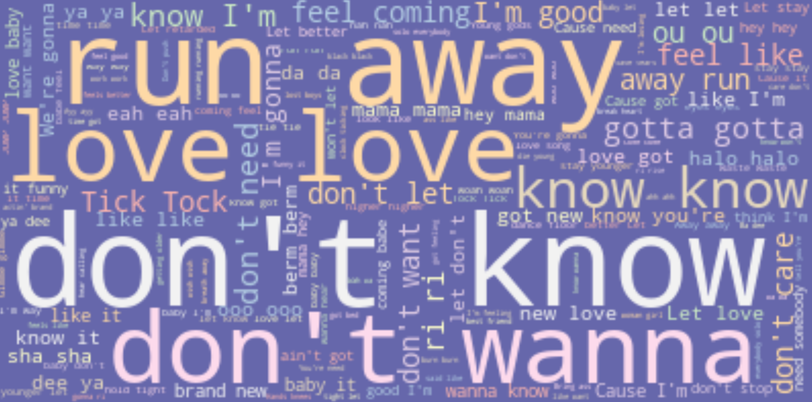
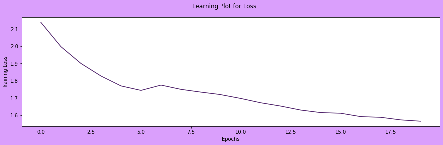
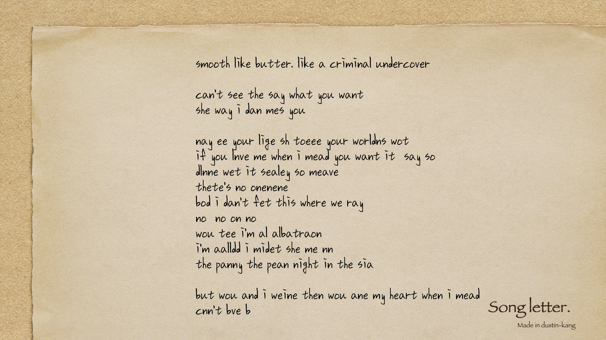

# 🎼 LSTM 모델을 이용한 가사 생성기


### 배경
- 텍스트 기반으로 한 딥러닝 모델에 대해 배웠고, 단어들의 배치 정도만 잘 이해하면 딥러닝 모델을 기반으로 음원 가사나 드라마 대사 들을 새로 생성해 낼 수 있지 않을까라는 생각으로부터 프로젝트를 진행하게 됨. 
- 보통 음악듣는 것에 관심이 많았고 **작사입문자에게도 문장 전체를 생성할 수는 없어도 영감을 받을 수 있을 것이기 때문**에 해당 주제를 선정하게 됨.
### 주제
> 첫 가사 텍스트를 입력하면 LSTM 모델 기반으로 추가 가사를 생성해주는 딥러닝 모델


# 디렉토리 구조

```bash
├── Note
│   ├── [P401]Collecting_Data.ipynb # 데이터 수집 파일
│   ├── [P402]Explore_Data.ipynb # 데이터 정리 파일
│   ├── [P402]WordClouds_Preprocessing.ipynb # 워드클라우드 시각화 파일
│   ├── [P403]data_preprocessing.ipynb # 전처리 과정 파일
│   ├── [P404]Modeling.ipynb # LSTM 모델링 파일
│   └── [P405]lyrics_generator.ipynb # 전체 데이터 파이프라인 정리
├── README.md
├── Visualization # 시각화를 위한 파일
│   ├── letter.png # Background 이미지 파일
│   └── 나눔손글씨 미래나무.ttf # font 파일
├── data # 데이터
│   ├── Songs.csv # 가사 중심의 가수들의 가사 데이터
│   └── vibe.csv # Naver Vibe Top 100 가사 파일 
├── model.pkl # 모델링 후 부호화한(pickling) 패키지 파일
├── image # ReadME 활용 이미지들
│   ├── WordCloud.png
│   ├── model_structure.png
│   ├── loss.png
│   └── title.png
└── keynote # 발표 디렉토리
    ├── keynote.pdf
    └── keynote.zip
```
# 제작 과정
### 데이터 수집
|Artist|Title|Lyrics|
|---|---|---|
|*가수명*|*노래제목*|*가사*|
|Bruno Mars, Anderson.Paak, Silk Sonic|Leave The Door Open|Say Baby, Say Baby, say Baby...|

- 처음, 데이터를 크롤링 했을 경우, **Naver Vibe의 해외 음악 장르를 직접 크롤링**하여 `Seleninum`을 통해서 진행함. 
    - 하지만, 너무 Oh! Yeah! 등 의성어가 있는 음악이 인기가 많았기도 하고, 라틴어 음악도 있었기에 어느정도 잘 알려진 Taylor Swift 나 Billie Eilish 등 **가사 중심 아티스트들의 데이터를 활용**함.

### 데이터 전처리
```py
Corpus =''
for listitem in data.Lyrics:
    Corpus += listitem
    
Corpus = Corpus.lower() 
print("유니크한 문자수:", len(set(Corpus)))
```
- 말 뭉치를 생성하기 위해 파이썬 내장 메소드와 정규 표현식을 사용하였음.
- 가사 중간 문자열만 들어가게되니, 특수문자나 라틴 문자를 제외 하기위해 전처리 과정을 진행함.

### 모델링


##### LSTM
- GATE : 과거 정보를 유지하면서 새로운 정보를 활용할 수 있음.
- Cell-state : 장기 기억 보존
- RNN 모델 기반 : 가사 생성에 적합한 순서 기반 모델이기 때문임.
##### 활성화 함수
- 소프트 맥스 함수 (다중 문제 적용을 위함)
##### 손실 함수
- Categorical_crossentropy (실제값과 예측값의 손실을 다중 분류에 쓰이는 C-CEE 사용)
##### 옵티마이저
- Adamax (방향과 스텝 사이즈를 적절하게 내려가기 위해)
    - 학습률 : 0.01 (하이퍼 파라미터)
##### 이터레이션
- 한 epoch 당 2064번의 이터레이션 발생
    - 배치 사이즈(Batch-size) : 128
        - 학습 속도를 키우기 위해 배치 사이즈를 올렸음.
    - 에폭 수(Epochs) : 20 

### 시각화


- 워드클라우드(WordCloud) 시각화 결과, `Run, Away, Love, Know, Wanna` 와 같은 동사 위주 단어들이 많이 사용되었고 생각한 대로 많이 쓰일 법한 `Love` 단어가 들어 있음.



- 위 그림과 같이 에폭 수(Epochs) 가 증가할수록 훈련에 대한 손실정도(loss)는 점차 감소하는 것으로 알 수 있음.

# 발표 영상 및 프로젝트 결과
### 프로젝트 결과


- 파이썬 이미지 처리 라이브러리(PIL)를 사용하여 프로젝트 결과를 도출해냄.
- 가장 맨 앞 문장인 "smooth like butter. like a criminal undercover" 이후부터 생성된 가사임.

### 발표 영상
[](https://youtu.be/WNwhE5bjIs8)
### 개선할점 및 피드백
- ~데이터를 직접 수집하셨다는 점이 인상 깊었습니다. 데이터 전처리, 모델 학습 결과 등을 잘 정리하여 설명해 주셨는데요, 덧붙여 해당 주제를 선정하게 된 이유와 학습 시킨 모델이 어떤 구조를 가지고 있는지를 설명해 주신다면 더욱 좋을 것 같습니다.~
    - 완성도있는 프로젝트를 위해 데이터 수집 방향을 변경하였고 주제와 모델 구조를 기재하였습니다.
